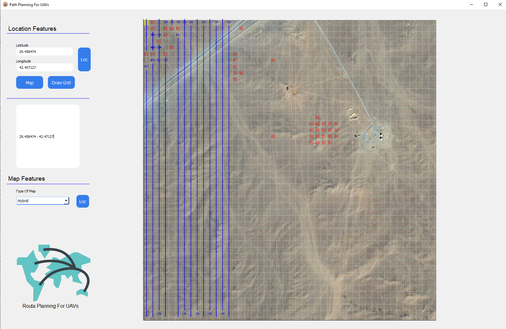

# AreaScanningForUAVs (QT_Designer+Python)
Searching for a solution to the field scanning problem for unmanned aerial vehicles with smart algorithms.

## Alan Tarama Problemi ve Çözüm Yaklaşımı ##

Yeryüzünün havadan ve uzaydan izlenebilmesi amacıyla askeri ve sivil maksatlı olarak birçok araç geliştirilmiştir ve kullanılmaktadır. Bu amaca ulaşabilmek için çalışmalar daha çok insansız ve otonom sistemlerin geliştirilmesi üzerine yoğunlaşmıştır. İnsansız ve otonom sistemlerin kullanımında çözülmesi gereken problemlerin en önemlilerinden birisi bu sistemlerin takip edeceği en uygun rotanın belirlenen kısıtlar dikkate alınarak bulunmasıdır. Alan tarama problemi kısaca; sınırları belirlenmiş bir bölge içerisindeki belirlenmiş hedef alanların, etmenler tarafından üzerinden geçiş yaparak taranması olarak tanımlanabilmektedir.

<ul>
  

  <li>Uydu ve İHA’lar tarafından yeryüzünün izlenmesi </li>
  <li>Çim biçme ve temizleme </li>
  <li>Zemin temizleme  </li>
   <li>Tarım ürünlerinin hasatı </li>
  <li>Mayın temizleme </li>
  <li>Duvar boyama </li>
  <li>Sınır bölgesi kontrolü</li>
  <li>Arama-kurtarma görevleri</li>
</ul>

Problemin tek etmenli durumu; gridlerin düğümleri oluşturduğu ve her bir gridden sadece komşu gridlere geçiş olan bir Gezgin Satıcı Problemi’dir. Çok etmenli durumun karmaşıklık seviyesi etmen sayısının yükselmesi ile daha da artmaktadır.
Söz konusu problemin çözüm yönteminde greedy yönteminden yararlanırmıştır. Hava arçlarının verilen koordinatlar dahilinde taraması gereken alanları söz konusu yöntem kullanılarak oluşturulan rotayı izleyerek tarama yapmaktadır.

Alan tarama işlemi gerçekleşirken bir çok faktör taramanın seyrini değiştirebilmektedir. Şekilde  kırmızı renk ile gösterilen alanlar uçuşa (taramaya) yasak bölgeler olarak belirlenmiş ve o alanların üzerinden geçmeyecek şekilde rota oluşturulup tarama gerçekleştirilmiştir. Bağımsız alanlar arası geçiş greedy (açgözlü) yaklaşımı ile en kısa yoldan gerçekleştirilmektedir.

QT designer ile tasarımı yapılmış olan söz konusu proje farklı koordinat ve senaryolara uygun genişletilebilir yapıya sahiptir. Bununla birlikte kullanılan veriler gerçek dünya verileridir. Kullanılan harita Gmaps yapısı kullanılarak elde edilmektedir. Girilen koordinatları doğrultusunda çapını kullanıcının belirlediği kadar olan alanı kesit olarak alarak üzerinde işlemler yapmaktadır. 

